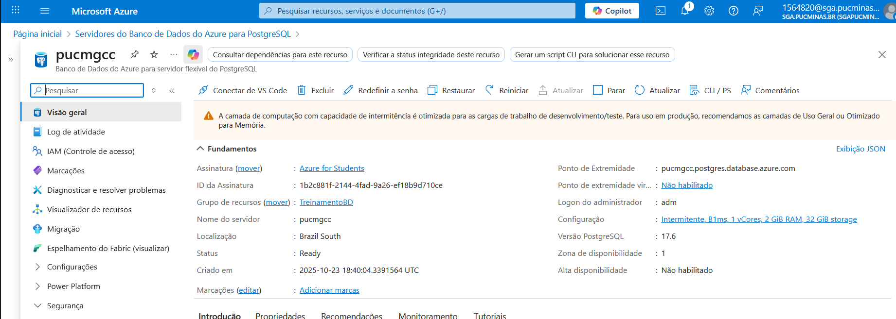
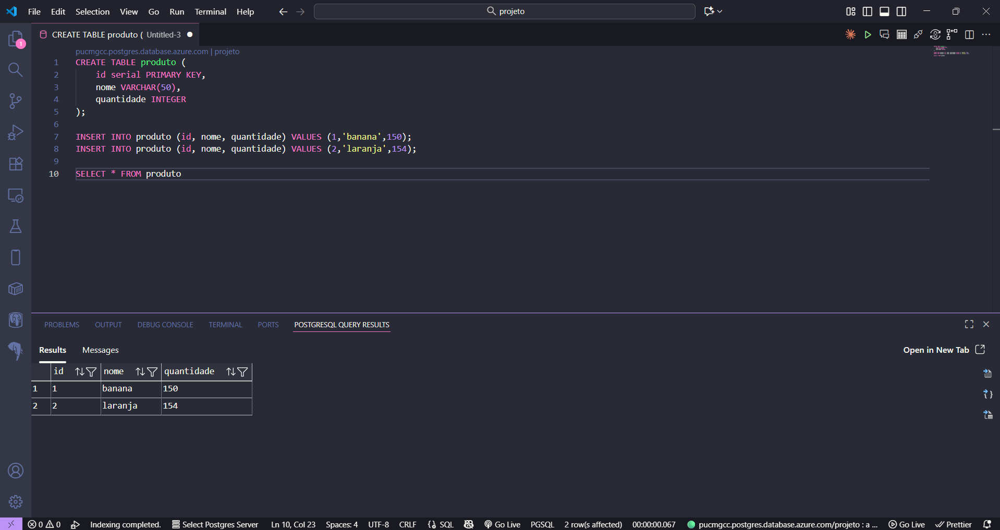

# Tarefa-01

# Tarefa-02

# Tarefa-03

# Tarefa-04

## Como executar:
1. Substitua `key` pela chave real do Azure Language Service
2. Substitua o endpoint pelo seu endpoint real
3. Compile: `javac App.java`

4. Execute: `java App`
